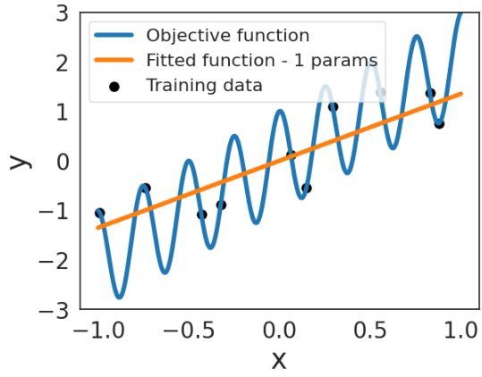
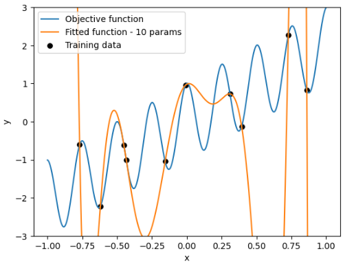
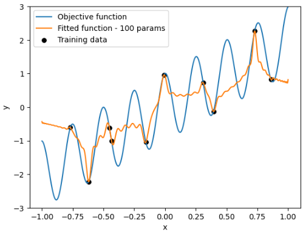
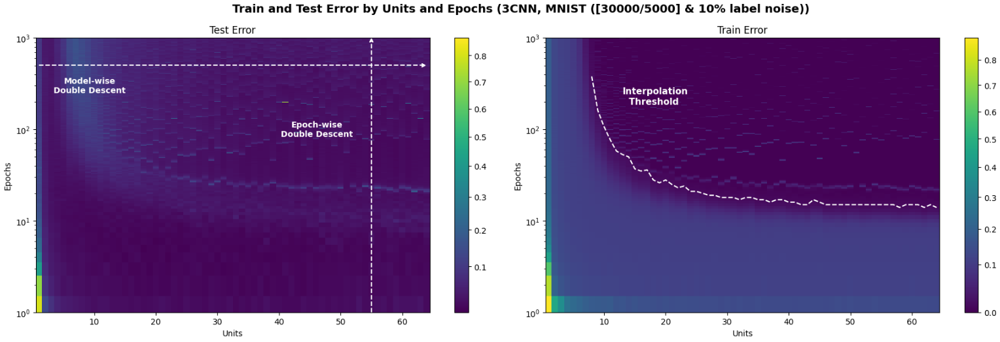
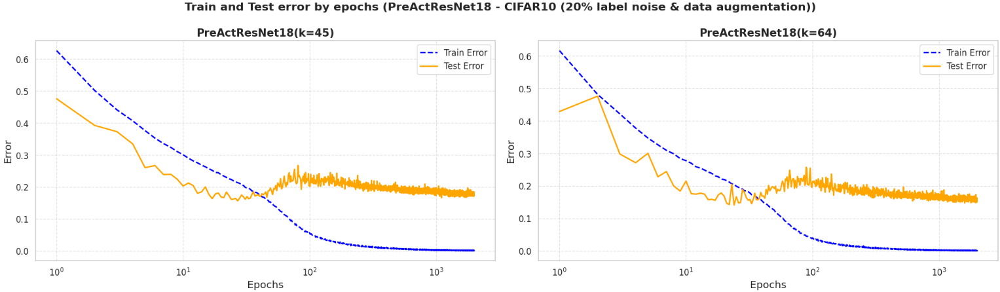

<h1 style="font-size: 3em;">Deep Double Descent</h1>

# Table of Contents

- [🎓 Introduction](#1-🎓-introduction)
- [📈 Main Results](#2-📈-main-results)
  - [🎯 Double Descent in Polynomial Regression](#️-double-descent-in-polynomial-regression)
  - [🧠 Deep Double Descent in Neural Networks](#️-deep-double-descent-in-neural-networks)
- [📁 Repository Structure](#3-📁-repository-structure)
- [🛠️ Installation](#4-🛠️-installation)
  - [✅ Requirements](#️-requirements)
  - [🔧 Setup Instructions](#️-setup-instructions)
- [📄 License](#5-📄-license)

---

# 1. 🎓 Introduction

Machine learning, particularly deep learning, has become essential across many fields. However, as models grow more complex, unexpected behaviors like Deep Double Descent emerge—challenging classical concepts such as the bias-variance trade-off and exposing gaps between theory and empirical results.

This project explores the computational and mathematical foundations behind Deep Double Descent, using both simple and advanced architectures. It aims to bridge traditional learning theory with modern trends, emphasizing interpretability, generalization, and the role of inductive biases in understanding overparameterized neural networks.

# 2. 📈 Main Results

Below are some of the key findings observed during our experiments. These results highlight the Deep Double Descent phenomenon in both simple polynomial regression and deep neural network settings.

### 🎯 Double Descent in Legendre Polynomial Regression

<div style="text-align: center;">
  
  <p><strong>Test error vs. Model complexity (number of params)</strong> showing the characteristic double descent curve in a simple regression using Legendre basis.</p>
</div>

<div style="display: flex; justify-content: space-between;">
  
  
  
</div>
Different approximations across various parameterization zones, highlighting implicit regularization in the final overparameterized model (on the right), which results in a solution resembling the initial approximation.

### 🧠 Deep Double Double Descent in Neural Networks

<div style="text-align: center;">
  
  <p><strong>Deep Double Descent by Model Capacity and Epochs</strong>, showing the test error (left image) in a heatmap versus model complexity (number of parameters) across varying epochs. The image highlights model-wise phenomena (horizontal lines) and epoch-wise phenomena (vertical lines). Additionally, the interpolation threshold can be observed in the train error heatmap (right image).</p>
</div>

<div style="text-align: center;">
  
  <p><strong>Epoch-wise Double Descent for PreActResNet</strong>, showing how test error decreases as the model approaches near-zero training error.</p>
</div>

---

These results support the hypothesis that overparameterized models can generalize better under certain training regimes, challenging classical assumptions of the bias-variance trade-off.

## 3. 📁 Repository Structure

```plaintext
Deep-Double-Descent/  
├── LaTex/                                  # LaTeX document with the project report  
├── experiments/                            # Experiment scripts and Jupyter notebooks for analysis and testing
│   ├── PlotNGPUresults                     # Jupyter notebook to plot results from NGPU experiments  
│   ├── Polynomial_approximation_(OLS_GD)   # Jupyter notebook for polynomial regression approximation (OLS + GD)
│   └── script                              # Shell script to launch neural network experiments 
├── results/                                # Results obtained from experiments (processed on NGPU)  
├── src/                                    # Project source code for neural networks
│   ├── main/                               # Main fucntion to execute the training process 
│   ├── models/                             # Model architectures and definitions
│   └── utils/                              # Utility functions for data loading, noise addition, data splitting, training, and evaluation
├── requirements.txt                        # Python dependencies needed to run the project  
├── README.md                               # README with the project description and overview   
```

## 4. 🛠️ Installation

### ✅ Requirements

- Python 3.10 (recommended)
- pip for dependency management

### 🔧 Setup Instructions

```bash
# Clone the repository
git clone https://github.com/jantonioruiz/Deep-Double-Descent.git
cd Deep-Double-Descent

# (Optional) Create and activate a virtual environment
python3.10 -m venv venv
source venv/bin/activate  # On Windows use: venv\Scripts\activate

# Install required dependencies
pip install -r requirements.txt
```

## 5. 📄 License

This project is licensed under the **MIT License**.  
See the [LICENSE](LICENSE) file for full details.